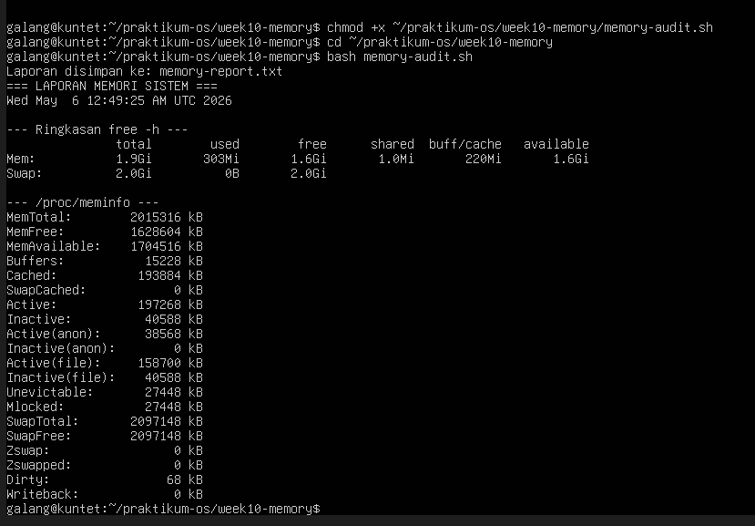
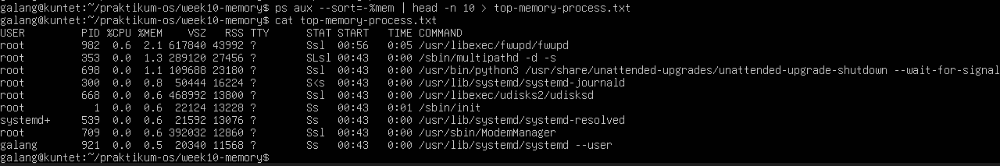
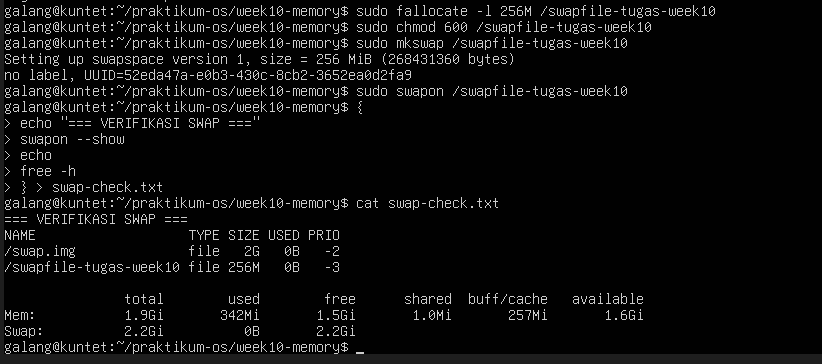
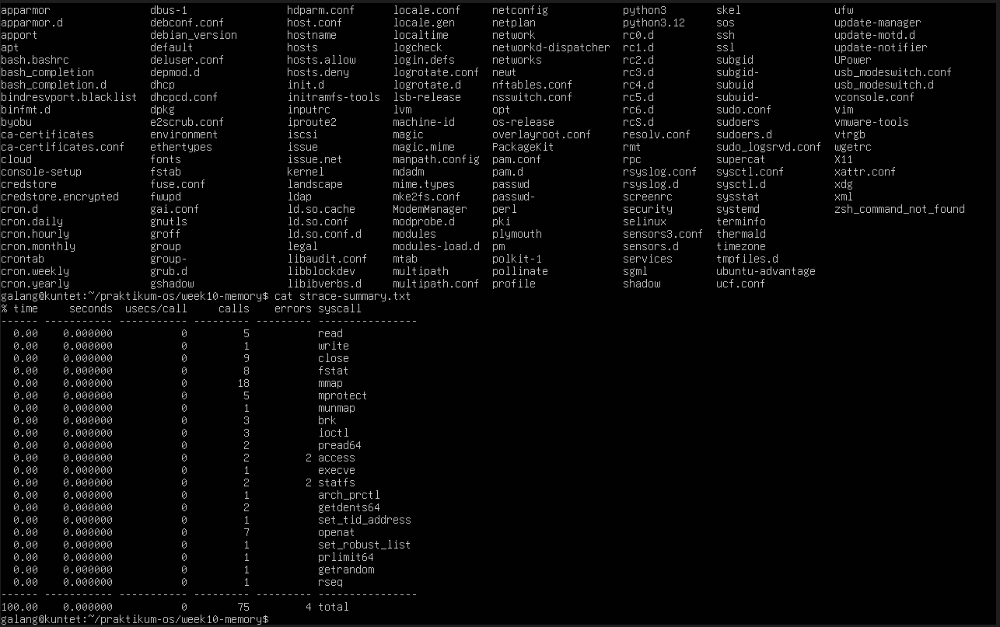
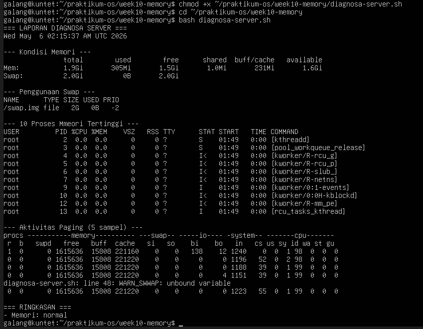

# PERTEMUAN 10

<h4> Nama : Galang Satriyo Anorrogo Winnada<h4>
<h4> NIM : 254107020231<h4>
<h4> Kelas : TI 1-H<h4>

## 1.6 Tugas Praktikum

### Tugas 10.1 Audit Penggunaan Memori Sistem
 Buat script memory-audit.sh yang menghasilkan laporan kondisi memori sistem secara otomatis.

### Pertanyaan  
Analisis
1. Hitung persentase memori tersedia (available / total × 100%). Apakah
sistem dalam kondisi normal?
2. Mengapa buff/cache tidak dihitung sebagai memori yang terpakai dari sudut
pandang ketersediaan untuk aplikasi?
3. Dari /proc/meminfo, apakah SwapTotal lebih besar dari 0? Berapa nilai
SwapFree?

### Jawaban

1. Presentase memori tersedia
Dari free -h:
Total = 1.9 GiB
available = 1.6 GiB
perhitungan = 1.6/1.9 * 100% = 84.2%
kesimpulan 
sekitar 84% memori masih tersedia, ini menunjukan sistem dalam kondisi normal (bahkan sangat longgar) karena masih banyak RAM yang bisa dipakai aplikasi 

2. Walaupun di free terlihat buff/cache seperti memakan memori, sebenarnya:
buff/cache = memori yang dipakai kernel untuk cahce
tujuanya untuk mempercepat akses file dan sistem
jika aplikasi butuh RAM, cahce ini bisa langsung dibebaskan otomatis
intinya: 
buff/cache itu "dipinjam sementara", bukan benar-benar terpaai permanen.
makanya tidak dianggap sebagai beban nyata bagi aplikasi 

3. Analisi swap dari /proc/meminfo
dari data: 
SwapTotal = 2,097,148 kB (~2.GiB) -> lebih  besar dari 0
SwapFree = 2,097,148 kB (~2. GiB)
kesimpulan: 
Swap tersedia (aktif)
tapi belum digunakan sama sekali (0 kB terpakai) -> ini tanda bagus, karena sistem masih cukup RAM dan tidak pertu swap

RINGKASAN : 
1. RAM tersedia ~84% -> sangat aman
2. cache tidak masalah -> bisa dilepas kapan saja
3. Swap ada tapi tida dipakai -> kondisi optimal

### Tugas 10.2 Identifikasi Proses dengan Memori Tertinggi
Simpan daftar 10 proses pengguna memori terbesar ke file.

### Pertanyaan
Analisis
1. Proses apa di urutan pertama? Catat nilai %MEM dan RSS.
2. Konversikan RSS ke MB (bagi 1024). Apakah wajar?
3. Jumlahkan %MEM dari 5 proses teratas. Berapa persen RAM yang mereka
gunakan bersama?

### Jawaban 

1. Proses di urutan pertama 
/usr/libexec/fwupd/fwupd
%MEM = 2.1%
RSS = 43992 KB
2. Konversi RSS KE MB
        43991 / 1024 = 42.96 MB (= 43 MB)
sangat wajar
proses fwupd (firmware update service) memang bisa memakai puluhan MB RAM saat aktif 
3. Total %MEM dari 5 proses teratas
Ambil 5 teratas
2.1%
1.3%
1.1%
0.8%
0.6%
Jumlah: 
        2.1 + 1.3 + 1.1 = 0.8 + 0.6 = 5.9%

KESIMPULAN:
1. Proses terbesar hanya pakai sekitar 43MB
2. 5 proses teratas hanya menggunakan sekitar 5.9% RAM
3. ini sangat ringan -> sistem kamu tidak sedang terbebani

### Tugas 10.3 Membuat dan Memverifikasi Swap File
Tugas 10.3 Membuat dan Memverifikasi Swap File

### Pertanyaan 
Analisis
1. Identifikasi kolom NAME, TYPE, SIZE, dan USED pada output swapon –show.
2. Apakah nilai total pada baris Swap di free -h bertambah 256 MB?
3. Mengapa permission 600 penting? Apa risiko jika diatur ke 644?

### Jawaban

1. Identifikasi kolom swapon --show
Dari output:x   
NAME                     TYPE SIZE USED PRIO
/swap.img                file 2G   0B   -2
/swapfile-tugas-week10   file 256M 0B   -3
Penjelasan:
NAME → lokasi file swap
Contoh: /swap.img, /swapfile-tugas-week10
TYPE → jenis swap (di sini: file, bukan partition)
SIZE → ukuran swap
(2 GB dan 256 MB)
USED → jumlah swap yang sedang digunakan
(masih 0B, belum terpakai)
2. Apakah total Swap bertambah 256 MB?
Dari free -h:
Swap total = 2.2 Gi
Sebelumnya swap utama ≈ 2.0 Gi, lalu ditambah 256 MB
→ hasilnya sekitar 2.25 Gi (dibulatkan jadi 2.2 Gi)
Kesimpulan:
✔️ Ya, total swap bertambah ±256 MB (sesuai swap baru yang dibuat)
3. Kenapa permission 600 penting?
Permission 600 artinya:
Owner (root): bisa baca & tulis
User lain: tidak punya akses sama sekali
Alasannya penting:
Swap bisa menyimpan data sensitif sementara (password, proses, dll)
Data di RAM yang dipindahkan ke swap tidak terenkripsi secara default
Risiko kalau 644:
User lain bisa membaca file swap
Bisa terjadi kebocoran data sensitif
Potensi security breach

KESIMPULAN:
Swap baru berhasil ditambahkan dan terdeteksi
Total swap meningkat sesuai ukuran file baru
Permission 600 itu krusial untuk keamanan sistem

### Tugas 10.4 Analisis System Call dengan strace
 Analisis system call yang dipanggil perintah ls.

 ### Pertanyaan 
 Analisis
1. Sebutkan minimal 5 system call dari strace-summary.txt beserta fungsi
singkatnya.
2. System call mana yang paling sering dipanggil? Mengapa?
3. Apakah ada errors lebih dari 0? Apakah program tetap berjalan normal
meskipun ada kegagalan tersebut?

### Jawaban 

1. Minimal 5 system call + fungsinya
Beberapa system call yang terlihat:
read → membaca data dari file descriptor (misalnya file atau input)
write → menulis data ke file descriptor (output ke layar/file)
openat → membuka file relatif terhadap directory tertentu
close → menutup file descriptor yang sudah dibuka
mmap → memetakan file atau memori ke address space proses
fstat → mengambil informasi metadata file
execve → menjalankan program baru
brk → mengatur ukuran heap (memori dinamis)
2. System call yang paling sering dipanggil
Dari kolom calls:
mmap = 18 kali → paling tinggi
Alasan:
mmap sering dipakai untuk:
loading library (shared library)
manajemen memori
Saat program dijalankan, banyak library di-load → makanya mmap dominan
3. Apakah ada error?
Di bagian bawah:
errors = 4 total
Artinya ada beberapa system call yang gagal.
 tetap normal
Kenapa?
Tidak semua error itu fatal
Contoh:
access gagal → hanya cek file (tidak wajib ada)
open gagal → program bisa fallback ke alternatif
Program biasanya sudah didesain untuk menangani error kecil

KESIMPULAN
Banyak system call dasar I/O dan memori digunakan
mmap paling dominan karena loading memori/library
Ada error kecil, tapi tidak mengganggu jalannya program

### Tugas 10.5 Studi Kasus Diagnosa Server Lambat
 Server terasa lambat. Buat script diagnosa yang menggabungkan semua
pemeriksaan dari bab ini menggunakan fungsi Bash.

### Pertanyaan
1. Jelaskan peran masing-masing fungsi: cek_memori, cek_swap, cek_proses,
cek_paging, dan ringkasan. Mengapa diagnosa dipecah menjadi fungsi
terpisah?
2. Berdasarkan bagian RINGKASAN, apakah kondisi sistem normal atau kritis?
Jelaskan berdasarkan nilai threshold yang digunakan script.
3. Mengapa script menggunakan tee "$LAPORAN" bukan redirection biasa >
"$LAPORAN"? Apa keuntungannya?
4. Dari output cek_paging, apakah ada aktivitas si atau so? Jika ada, apa
implikasinya terhadap performa server?

### Jawaban

1. Peran Masing-Masing Fungsi
cek_memori
Mengambil snapshot penggunaan RAM menggunakan free -h. Fungsi ini membaca total, used, free, shared, buff/cache, dan available memory. Dari output terlihat: Total RAM 1.9Gi, Used 305Mi, Free 1.5Gi — kondisi sangat longgar.
cek_swap
Memeriksa penggunaan swap via swapon --show. Menampilkan nama device, tipe, ukuran, dan prioritas. Output menunjukkan /swap.img berukuran 2G dengan 0B terpakai — swap sama sekali tidak digunakan, artinya RAM masih sangat cukup.
cek_proses
Menampilkan 10 proses dengan konsumsi memori tertinggi menggunakan ps aux --sort=-%mem. Dari output, semua proses kernel (kthreadd, kworker, dll) menunjukkan %MEM = 0.0 — tidak ada proses berat yang berjalan.
cek_paging
Mengambil 5 sampel aktivitas paging/swapping menggunakan vmstat. Memantau kolom si (swap-in) dan so (swap-out) untuk mendeteksi memory pressure.
ringkasan
Mengagregasi hasil semua fungsi di atas dan memberi verdict akhir berdasarkan threshold. Output menunjukkan "Memori: normal".
2. Parameter Nilai Aktual Threeshold Umum Status
RAM Used305Mi / 1.9Gi (~16%)Kritis jika >80-90% Normal
Swap Used0B / 2Gi (0%)Kritis jika >50% Normal
%MEM proses tertinggi0.0%Waspada jika >10% Normal
Available RAM1.6GiKritis jika <10% total Normal
    #### Contoh logika threshold yang umum digunakan
    if [ $mem_used_percent -gt 90 ]; then
    status="KRITIS"
    else
    status="normal"
    fi

3. #### Yang digunakan script:
    } | tee "$LAPORAN"

    #### Versus:
    } > "$LAPORAN"
Dengan  >  :   Output → File saja  (terminal tidak menampilkan apapun)
Dengan tee :   Output → File DAN → Terminal secara bersamaan (real-time)

    Keuntungan teePenjelasanDual outputAdmin bisa melihat hasil di terminal sekaligus tersimpan ke fileReal-time monitoringOutput muncul langsung saat script berjalan, tidak perlu tunggu selesai lalu cat fileLogging + interaktifCocok untuk script diagnosa yang perlu dipantau live sekaligus diarsipkanDebugging lebih mudahError/output langsung terlihat tanpa harus membuka file terpisah
    Dengan > murni, terminal akan blank total selama script berjalan — kurang ideal untuk tool diagnosa server.
4. Hasil Analisis:
Kolom si (swap-in): 0 di semua sampel → Tidak ada aktivitas
Kolom so (swap-out): 0 di semua sampel → Tidak ada aktivitas
 Kesimpulan: TIDAK ADA paging/swapping activity

     Implikasi Jika si/so > 0 (untuk referensi):
KondisiNilai si/soImplikasiNormal0RAM cukup, tidak ada tekanan memoriWaspada1-10 KB/sSesekali swap, performa sedikit turunKritis>100 KB/sThrashing — server lambat drastis karena I/O disk jauh lebih lambat dari RAM