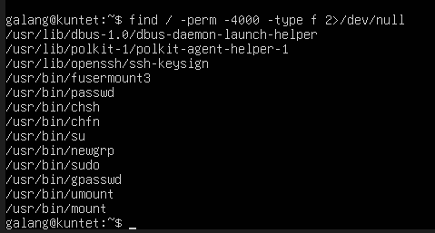
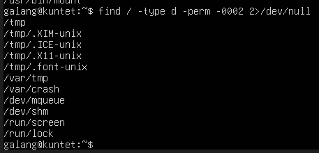
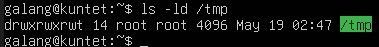
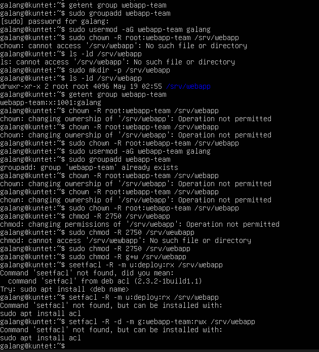

# PERTEMUAN 11

<h4> Nama : Galang Satriyo Anorrogo Winnada<h4>
<h4> NIM : 254107020231<h4>
<h4> Kelas : TI 1-H<h4>

## 1.7 Latihan

### Latihan Latihan 9.A — Audit dan Kolaborasi
1. Temukan file SUID aktif dengan find / -perm -4000 -type f 2>/dev/null, lalu jelaskan
tiga file yang Anda kenali beserta alasannya.
2. Cari direktori world-writable dan tentukan mana yang valid dan mana yang berisiko.
3. Rancang konfigurasi permission standar dan ACL untuk direktori proyek /srv/webapp/ agar
group webapp-team dapat menulis, user deploy hanya membaca, dan file baru selalu mewarisi
group proyek.

### Jawaban
1. 

a. /usr/bin/passwd
Fungsi: Mengubah password user.
Kenapa SUID?
Karena file /etc/shadow hanya bisa diakses root, tapi user biasa tetap harus bisa ganti password.
Jadi: program ini dijalankan dengan hak akses root sementara.

b. /usr/bin/sudo
Fungsi: Menjalankan perintah sebagai user lain (biasanya root).
Kenapa SUID?
Supaya user biasa bisa "naik hak akses" sesuai konfigurasi di /etc/sudoers.
Risiko:
Kalau ada bug → bisa jadi privilege escalation.

c. /usr/bin/chsh
Fungsi: Mengubah shell default user.
Kenapa SUID?
Karena dia mengubah /etc/passwd, yang butuh hak root.
Jadi tetap aman karena dibatasi hanya pada field tertentu.

2. 

Contoh:
/home/project
/opt/app
/srv/webapp (kalau salah setting)
Kenapa berbahaya?
Semua user bisa:
menambah file
mengganti file
inject script berbahaya

3. 

### Latihan Latihan 9.B — Kebijakan Akun dan Quota
Tuliskan langkah untuk membuat user intern, menambahkannya ke group labgroup, memaksa pergantian password tiap 45 hari (warning 7 hari), memberi izin sudo hanya untuk systemctl status, dan
menetapkan quota ruang serta inode sederhana pada /home/.

### Jawaban
1. Membuat user intern
sudo useradd -m -s /bin/bash intern
sudo passwd intern
2. Menambahkan ke group labgroup
sudo groupadd labgroup
Tambahkan user:
sudo usermod -aG labgroup intern
3. Atur kebijakan password (45 hari, warning 7 hari)
sudo chage -M 45 -W 7 intern
4. Batasi sudo hanya untuk systemctl status
sudo visudo
5. Setup quota disk & inode di /home
/dev/sda1 /home ext4 defaults,usrquota,grpquota 0 2
6. Cek quota
quota -u intern