 # PERTEMUAN 6

<h4> Nama : Galang Satriyo Anorrogo Winnada<h4>
<h4> NIM : 254107020231<h4>
<h4> Kelas : TI 1-H<h4>

### Praktikum 6.1 — Melihat Proses dan Thread
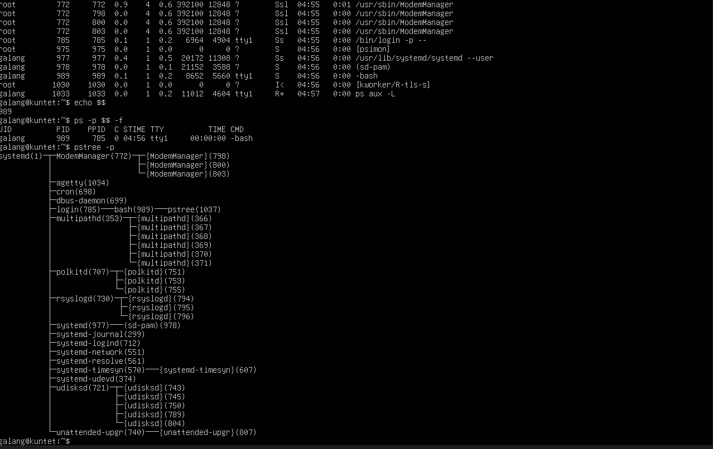

### LATIHAN 6.1

Jalankan ps aux dan amati outputnya:

1. Berapa total proses yang berjalan? Proses apa yang memiliki PID
terkecil?
2. Jalankan pstree -p dan temukan proses bash Anda. Proses apa yang
menjadi induk (PPID) dari bash tersebut?
3. Bandingkan output ps aux dan ps aux -L. Apa perbedaan yang Anda
lihat?

## JAWABAN : 

1. Total proses yang berjalan
→ Bisa dihitung dari jumlah baris output (biasanya pakai):
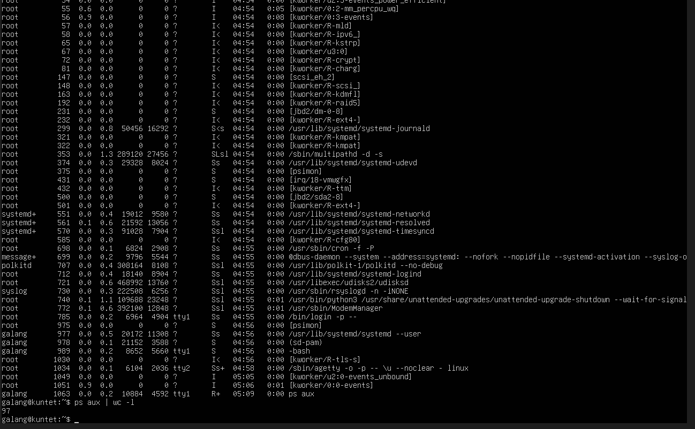 

2. gnome-terminal (kalau pakai GUI)
atau sshd (kalau via SSH)
atau init/systemd (kalau langsung login TTY)
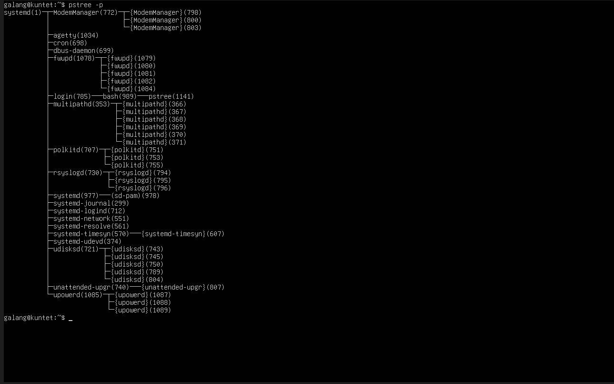

3. ps aux
Menampilkan daftar proses saja
Setiap baris = 1 proses
ps aux -L
Menampilkan thread (lightweight process)
1 proses bisa muncul lebih dari satu baris
Ada tambahan kolom:
LWP (Light Weight Process / Thread ID)

### Praktikum 6.2 — Mengamati Siklus Hidup Proses

1. 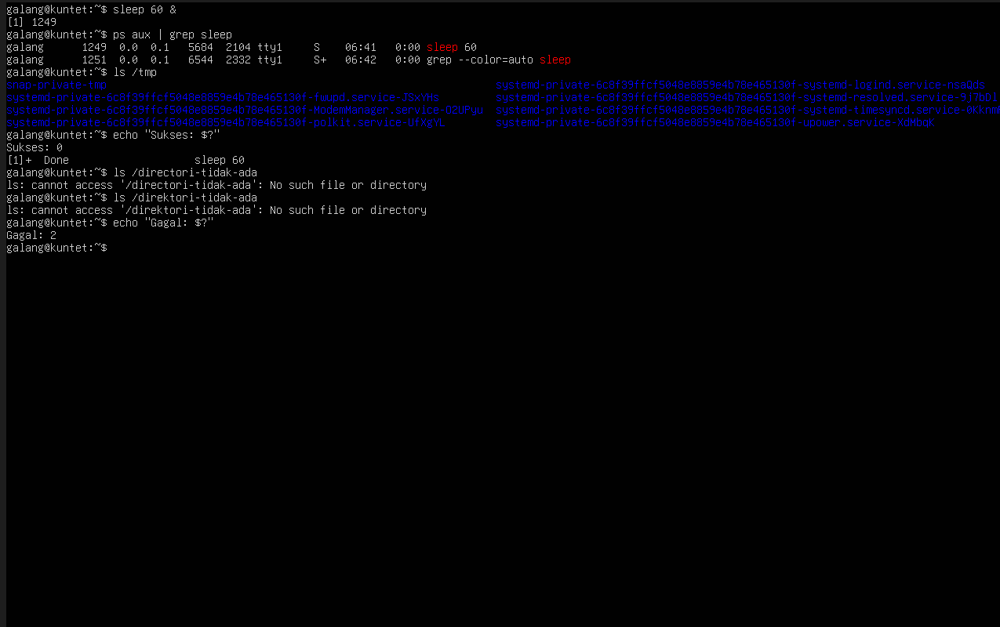

### Latihan 6.2
1. Jalankan sleep 120 & dan amati kolom STAT pada ps aux. Kondisi
apa yang ditampilkan? Mengapa proses sleep berada di kondisi tersebut?
2. Jalankan beberapa perintah yang berhasil dan yang gagal, lalu catat exit
code masing-masing. Pola apa yang Anda temukan?

## JAWABAN

1. 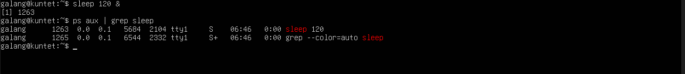
Arti kondisi tersebut:
S (Sleeping) → proses sedang “tidur” (menunggu)
Artinya proses tidak menggunakan CPU, hanya menunggu waktu selesai
Kenapa sleep berada di kondisi itu?
Karena:
Perintah sleep 120 memang tidak melakukan kerja aktif
Hanya menunggu 120 detik
Jadi sistem menaruhnya dalam kondisi sleeping (idle)

2. 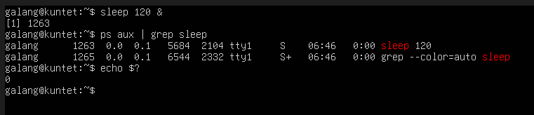
Penjelasan:
0 → sukses (no error)
Non-zero (1, 2, dst) → ada error
Nilai berbeda menunjukkan jenis error yang berbeda
Kesimpulan
sleep 120 ada di status S (sleeping) 
karena hanya menunggu waktu tanpa aktivitas CPU
Exit code mengikuti pola:
0 = berhasil
selain 0 = gagal

### Praktikum 6.3 — Mengatur Prioritas Proses
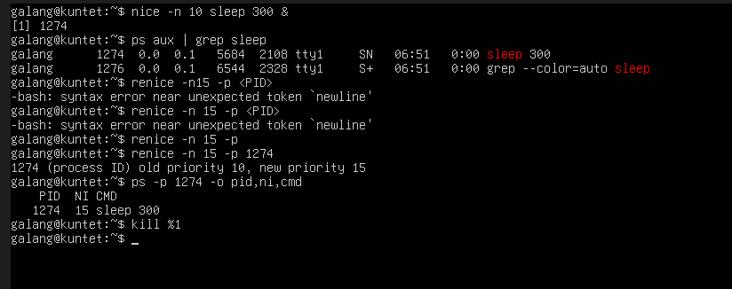

### Latihan 6.3 
1. Jalankan nice -n 5 sleep 200 & dan verifikasi nilai NI-nya dengan
ps.
2. Ubah nilai nice menjadi 10 menggunakan renice, lalu verifikasi kembali.
3. Coba ubah nilai nice menjadi -5 tanpa sudo. Apa yang terjadi? Mengapa
Linux membatasi hal ini untuk user biasa?

## JAWABAN
1. 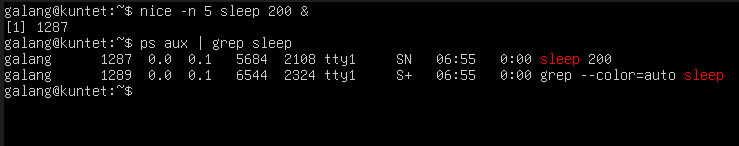
Penjelasan:
nice -n 5 artinya proses diberi prioritas lebih rendah dari default
Default nice = 0
Semakin besar nilai nice → prioritas makin rendah

2. 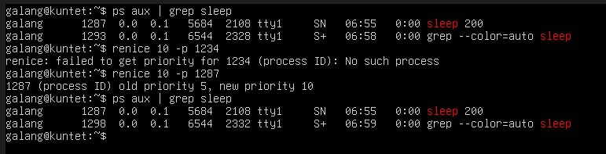
Penjelasan:
renice digunakan untuk mengubah prioritas proses yang sudah berjalan
Nilai 10 → prioritas lebih rendah dibanding 5

3. 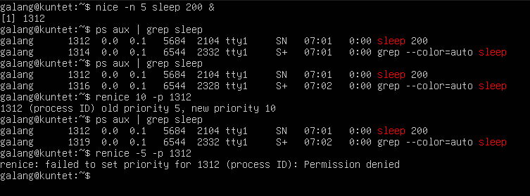
Penjelasan:
Nilai nice negatif berarti:
prioritas lebih tinggi (lebih cepat dapat CPU)
Linux membatasi user biasa karena:
Mencegah penyalahgunaan CPU
User bisa bikin prosesnya mendominasi sistem
Menjaga kestabilan sistem
Proses penting (systemd, kernel task) bisa terganggu
Keamanan multi-user
Agar satu user tidak merugikan user lain

### Praktikum 6.4 — Mengirim Sinyal ke Proses
1. 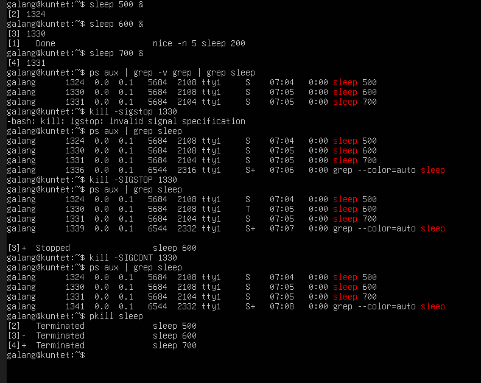

### Latihan 6.4
1. Jalankan sleep 400 &, kirim SIGSTOP, dan amati perubahan kolom
STAT. Kondisi apa yang muncul?
2. Kirim SIGCONT dan verifikasi proses kembali berjalan.
3. Hentikan proses dengan SIGTERM lalu verifikasi sudah tidak ada. Kapan
Anda memilih SIGKILL daripada SIGTERM?

## JAWABAN
1. 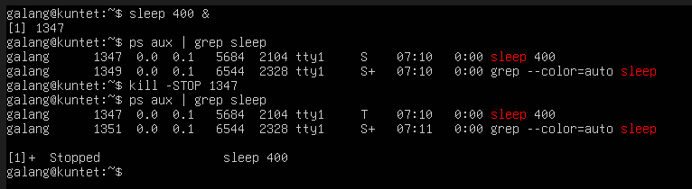
Artinya:
T (Stopped) → proses dihentikan sementara (pause)
Proses tidak berjalan, tapi masih ada di memori

2. 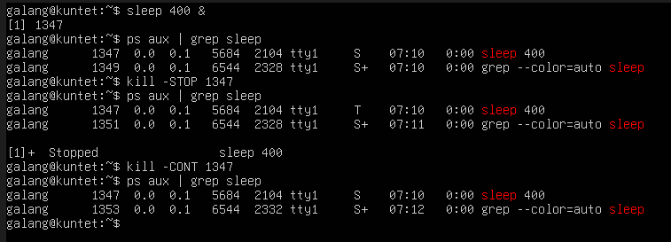
Artinya:
Proses kembali running (sleeping state)
sleep lanjut menghitung waktu lagi

3. 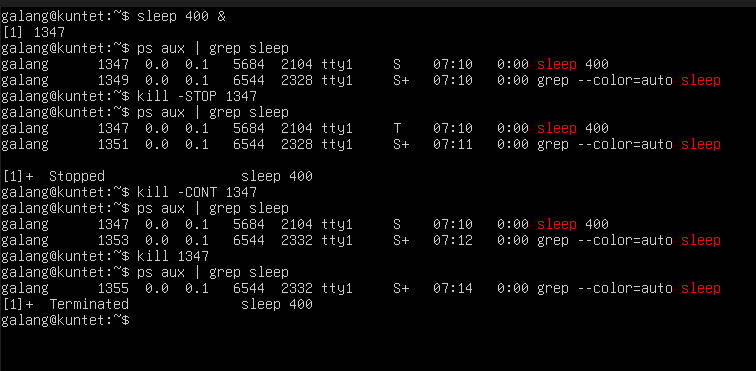
Kapan pakai SIGKILL daripada SIGTERM?
SIGTERM (default)
Digunakan saat:
Ingin menghentikan proses secara normal
Proses masih bisa:
menyimpan data
menutup resource dengan rapi

SIGKILL (kill -9)
Digunakan saat:
Proses bandel / tidak merespon SIGTERM
Proses:
hang / freeze
deadlock
tidak bisa dihentikan biasa

kenapa SIGKILL tidak selalu dipakai?
Karena:
Proses langsung dimatikan paksa
Tidak sempat:
save data
cleanup resource
Bisa menyebabkan:
data corrupt
file rusak
Kesimpulan
SIGSTOP → STAT = T (stopped)
SIGCONT → proses lanjut (STAT = S)
SIGTERM → proses berhenti normal
SIGKILL → dipakai hanya jika proses tidak bisa dihentikan biasa

### Praktikum 6.5 — Manajemen Job Foreground dan Background
1. 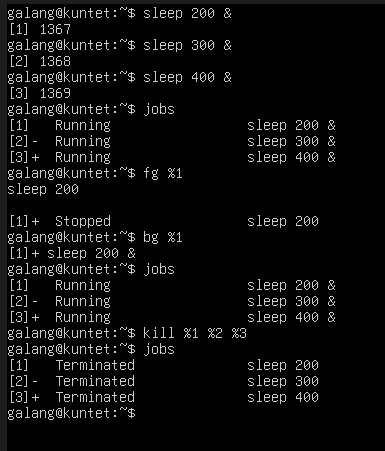

### Latihan 6.5
1. Jalankan top di foreground. Apa yang terjadi di terminal?
2. Tekan Ctrl+Z dan cek statusnya dengan jobs. Kondisi apa yang
ditampilkan?
3. Pindahkan ke background dengan bg. Apakah top dapat berjalan dengan
baik di background? Mengapa?
4. Kembalikan ke foreground dengan fg, lalu keluar dengan q .

## JAWABAN
1. 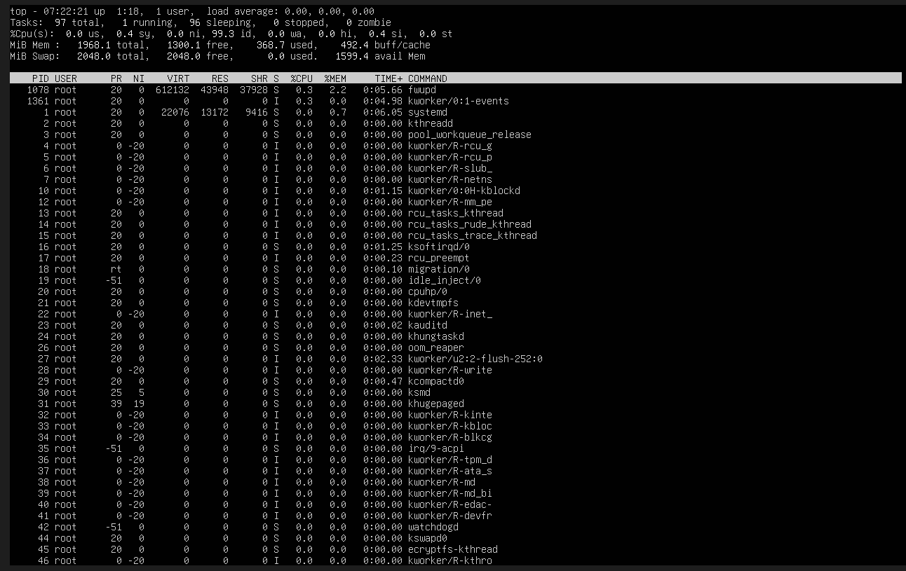
Terminal akan menampilkan monitor proses secara real-time
Informasi yang muncul:
penggunaan CPU
penggunaan memori
daftar proses aktif
Tampilan akan terus update otomatis

2. 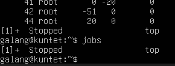
Kondisi:
Status = Stopped
Artinya:
Proses top dihentikan sementara (suspend)
Sama seperti kondisi STAT = T

3.  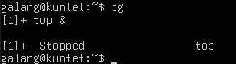
top adalah program interaktif
Membutuhkan:
akses langsung ke terminal
input keyboard
output layar real-time

4.  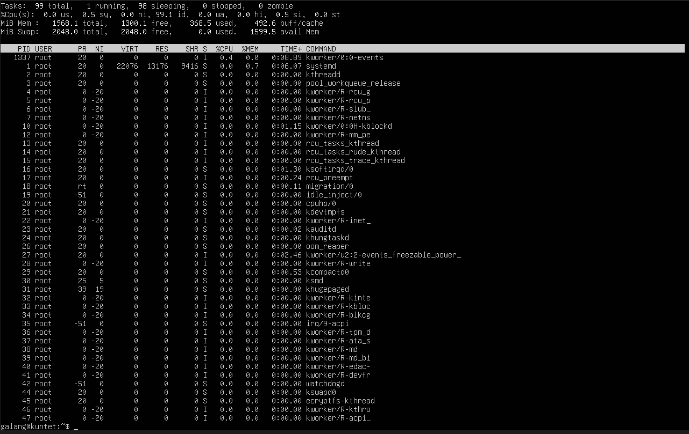
top di foreground → menampilkan monitoring real-time dan mengunci terminal
Ctrl + Z → status Stopped
bg → top tidak efektif karena butuh interaksi terminal
fg → kembalikan ke foreground, lalu keluar dengan 

### Praktikum 6.6 — Pemantauan Proses
1. 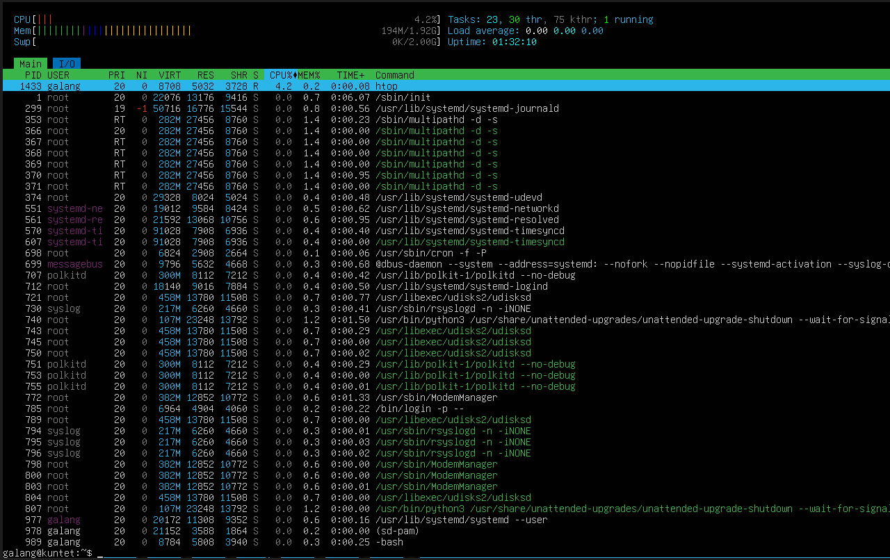

### Latihan 6.6 
1. Gunakan ps aux –sort=%mem untuk menemukan proses yang menggunakan memori paling banyak di VM Anda. Proses apa itu?
2. Di dalam top, tekan 1 . Apa yang berubah pada tampilan? Mengapa
informasi ini berguna?
3. Di dalam htop, navigasikan ke proses sshd menggunakan tombol panah.
Tekan F9 dan amati opsi sinyal yang tersedia.

## JAWABAN
1. 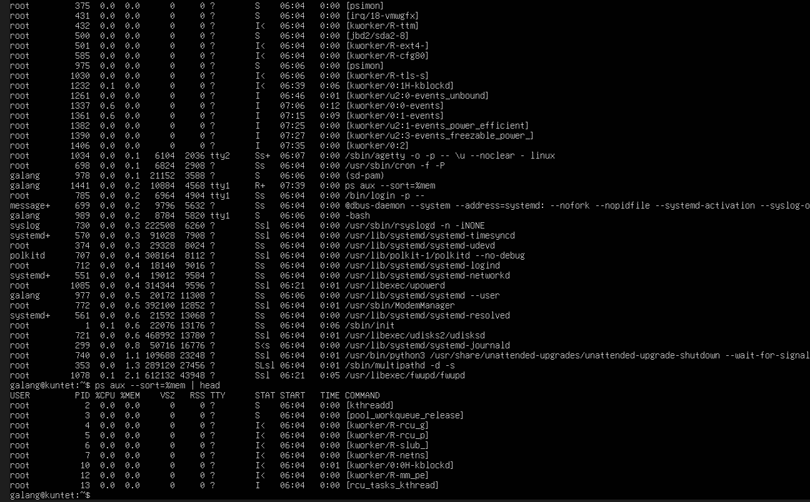
Proses yang muncul di baris paling atas adalah yang menggunakan memori paling besar
Contoh umum di VM:
firefox
chrome
java
gnome-shell
atau aplikasi yang sedang kamu jalankan

2. Tampilan CPU berubah dari:
1 baris total CPU
menjadi:
beberapa baris (per core CPU)
Kenapa ini berguna?
Bisa melihat beban tiap core CPU
Membantu:
mendeteksi bottleneck
melihat apakah proses hanya pakai 1 core
analisis performa sistem

3. 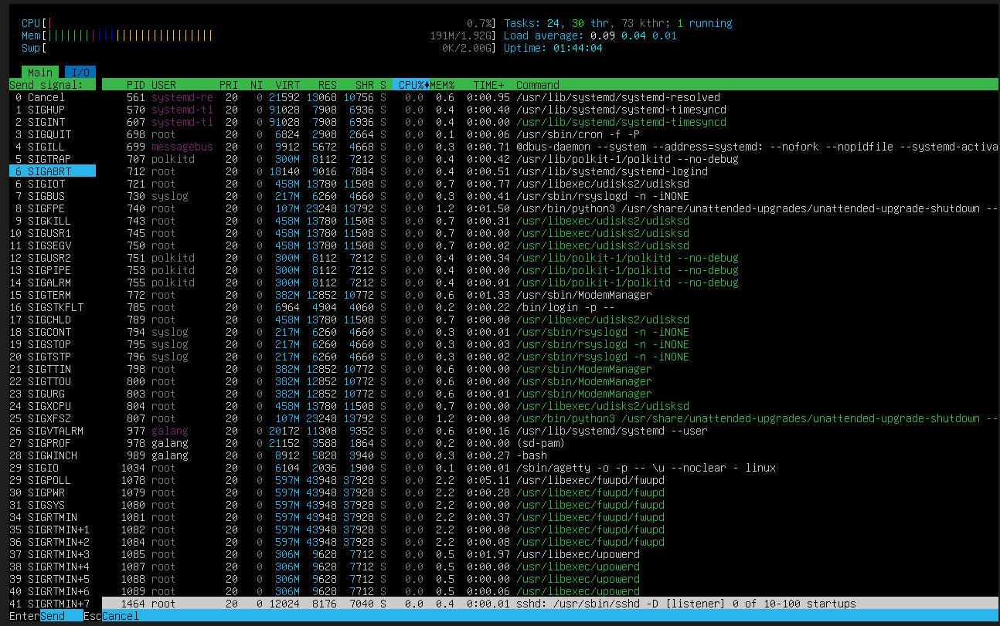
Biasanya akan terlihat daftar seperti:

SIGTERM (15) → terminate (default)
SIGKILL (9) → kill paksa
SIGSTOP (19) → pause
SIGCONT (18) → lanjutkan
SIGHUP (1)
dll
Penjelasan:
htop mempermudah pengiriman sinyal tanpa command manual (kill)
Kamu bisa memilih jenis sinyal sesuai kebutuhan

### 1.8 LATIHAN 

### Latihan 6.A
Eksplorasi Proses Sistem
1. Jalankan ps aux –forest dan temukan proses dengan PID 1. Apa
nama dan fungsi proses tersebut dalam sistem Linux modern?
2. Hitung berapa proses yang dimiliki oleh user root dan berapa yang
dimiliki oleh user Anda. Mengapa root memiliki lebih banyak proses?
3. Temukan semua proses yang berada dalam kondisi S. Mengapa sebagian
besar proses di sistem berada dalam kondisi ini?

## JAWABAN
1. 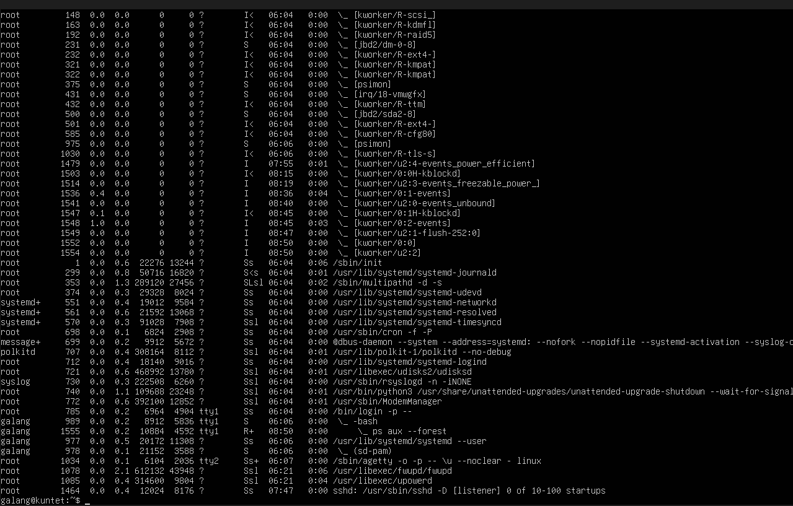
Fungsi systemd:
Merupakan proses pertama yang dijalankan saat booting
Berperan sebagai:
init system (induk semua proses)
Mengelola service (ssh, network, dll)
Menjalankan dan menghentikan proses sistem

2. 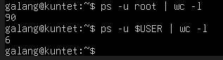
Biasanya:
root → lebih banyak proses
user biasa → lebih sedikit

3. 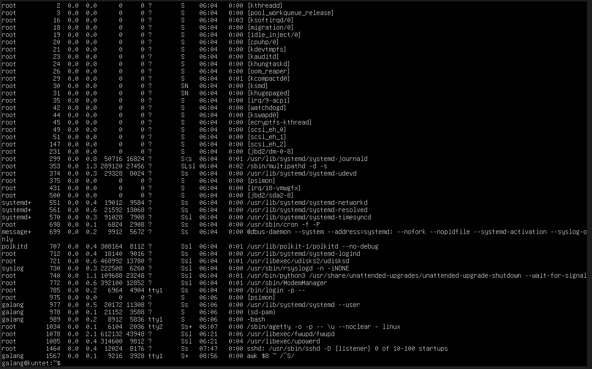
Karena:
Proses tidak selalu aktif menggunakan CPU
Mereka:
menunggu input
menunggu event
idle

Kesimpulan : 
1. PID 1 = systemd, berfungsi sebagai induk semua proses
2. Root punya lebih banyak proses karena menjalankan service sistem
3. Banyak proses dalam kondisi S karena sedang menunggu (idle), bukan error

### Latihan 6.B
1. Jalankan tiga perintah sleep dengan durasi 100, 200, dan 300 detik di
background. Verifikasi ketiganya dengan jobs.
2. Bawa job kedua ke foreground, jeda dengan Ctrl+Z , lalu kembalikan
ke background dengan bg.
3. Hentikan job pertama dengan kill %1. Tampilkan kembali daftar job.
Berapa job yang tersisa?

## JAWABAN
1. 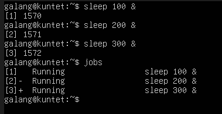
Ada 3 job aktif di background

2. 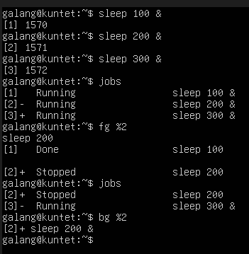
Job ke-2 kembali Running di background

3. 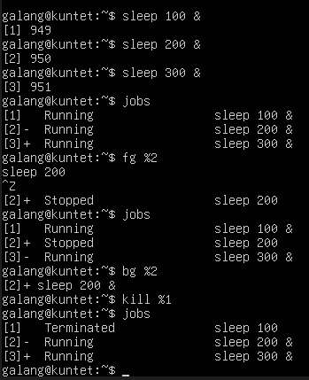
Jumlah job yang tersisa = 2

### Latihan 6.C
1. Jalankan dua proses sleep: satu dengan nice +5 dan satu dengan nice
+15. Verifikasi nilai NI keduanya dengan ps.
2. Gunakan renice untuk mengubah nice proses pertama menjadi +10.
Proses mana yang kini lebih diprioritaskan scheduler?
3. Kirim SIGSTOP ke salah satu proses, verifikasi kondisi T-nya, lalu kirim
SIGCONT. Akhiri semua proses percobaan dengan pkill sleep

## JAWABAN
# Bagian 1: Job Control (sleep & jobs)
1. 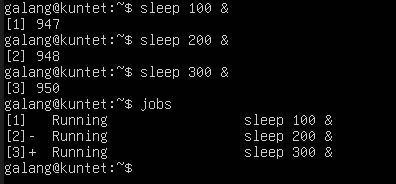

2. 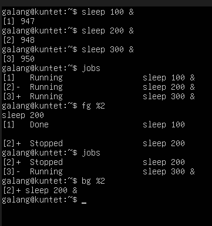

3. 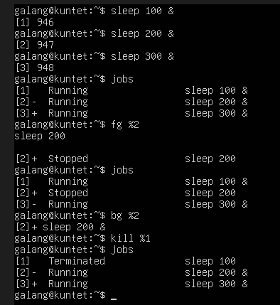
Awalnya: 3 job
Setelah kill %1: tersisa 2 job
# Bagian 2: Nice, Renice, dan Signal
 1. 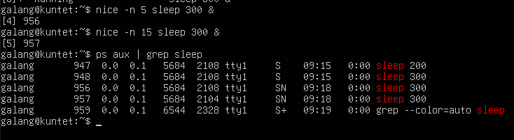
 Satu proses → NI = 5
Satu proses → NI = 15

2. 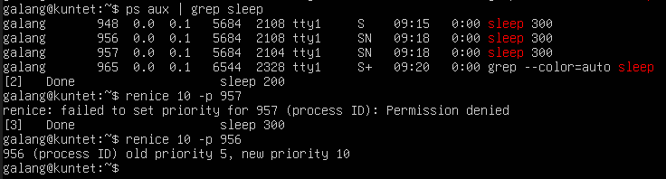
Sekarang:
Proses 1 → NI = 10
Proses 2 → NI = 15

3. 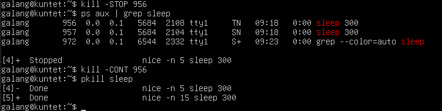

Kesimpulan

Bagian 1:

1. jobs menampilkan semua job background
2. fg, bg, kill %n → kontrol job
3. Setelah kill %1 → tersisa 2 job

Bagian 2:

1. Nice kecil = prioritas tinggi
2. Setelah diubah → NI 10 lebih prioritas daripada NI 15
3. SIGSTOP → T (stopped)
4. SIGCONT → lanjut
5. pkill sleep → hentikan semua proses