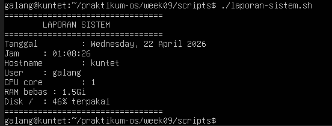
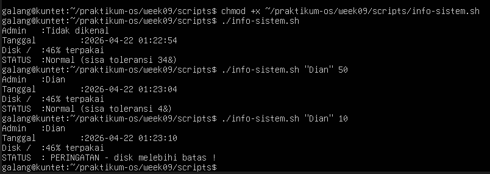
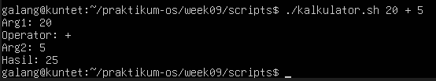
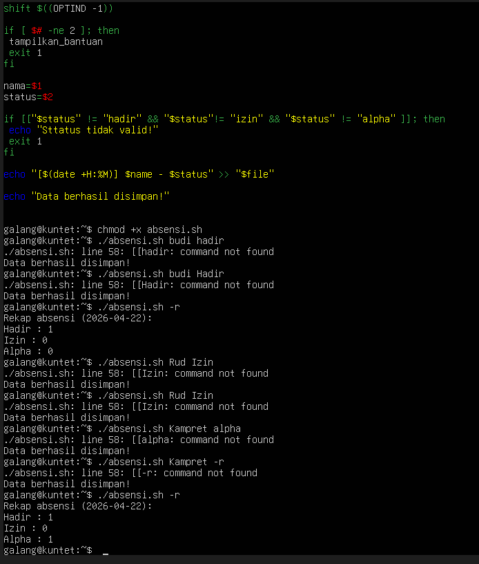
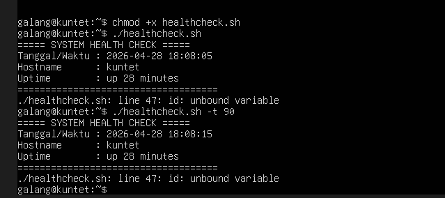

# PERTEMUAN 9

<h4> Nama : Galang Satriyo Anorrogo Winnada<h4>
<h4> NIM : 254107020231<h4>
<h4> Kelas : TI 1-H<h4>

## Praktikum 7.1 Script Pertama: Laporan Sistem
Tujuan: membuat, menyimpan, dan menjalankan script Bash pertama.

1. Buat workspace praktikum:
2. Buat script dengan nano:
3. Ketik isi berikut, simpan ( Ctrl+O Enter ), lalu keluar ( Ctrl+X ):
4. Beri izin dan jalankan:

## Latihan Latihan 9.1
Modifikasi laporan-sistem.sh agar menyimpan output ke file
laporan-YYYY-MM-DD.txt sekaligus menampilkannya di terminal. Petunjuk:
gunakan tee yang sudah dipelajari di bab sebelumnya.

### JAWABAN 
1. 

## Praktikum 7.2 Script Info Sistem dengan Argumen
Tujuan: berlatih variabel, substitusi perintah, parameter posisional, dan nilai default.
1. Buat script:
2. Ketik isi berikut:
3. Simpan, beri izin, uji dengan berbagai kombinasi argumen:

### Latihan Latihan 9.2
Buat script kalkulator.sh yang menerima tiga argumen: angka1
operator angka2 dengan operator +, -, *, atau /. Contoh:
./kalkulator.sh 20 + 5 menghasilkan 25. Gunakan case untuk memilih
operasi, dan validasi jika argumen tidak lengkap.

### JAWABAN

# 1.8 Tugas Praktikum
## Tugas 1 Script Absensi Kelas
Konteks: instruktur mencatat kehadiran mahasiswa dari command line.
Instruksi:
1. Buat script absensi.sh yang:
• Menerima argumen nama mahasiswa dan status (hadir/izin/alpha)• Menyimpan entri ke absensi-YYYY-MM-DD.txt dengan format [HH:MM]
NAMA - STATUS
• Opsi -r: tampilkan rekapitulasi (jumlah per status)
• Opsi -h: tampilkan bantuan
2. Rekam minimal 5 entri dan tampilkan rekapitulasinya.
Konsep wajib: variabel, parameter posisional, getopts, if, for, fungsi, dan
redirection ke file.
## Jawaban

## Tugas 2 Script Health Check Sistem
Konteks: administrator membuat pemeriksaan kondisi server sebelum maintenance.
Instruksi:
1. Buat script healthcheck.sh menggunakan template profesional dari bagian
Best Practices.
2. Script menampilkan: tanggal/waktu, hostname, uptime, penggunaan CPU,
memori, dan disk untuk setiap filesystem yang terpasang.
3. Jika penggunaan disk mana pun melebihi 80%, tampilkan peringatan.
4. Simpan hasil ke healthcheck-YYYY-MM-DD.log dan tampilkan ke terminal
sekaligus menggunakan tee.
5. Opsi -t <persen> mengubah batas peringatan disk (default 80).
Konsep wajib: set -euo pipefail, trap, getopts, fungsi dengan local,
for, if, dan tee.
## Jawaban

