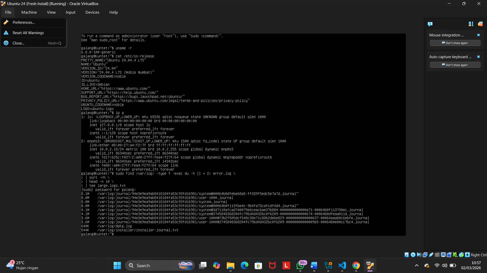
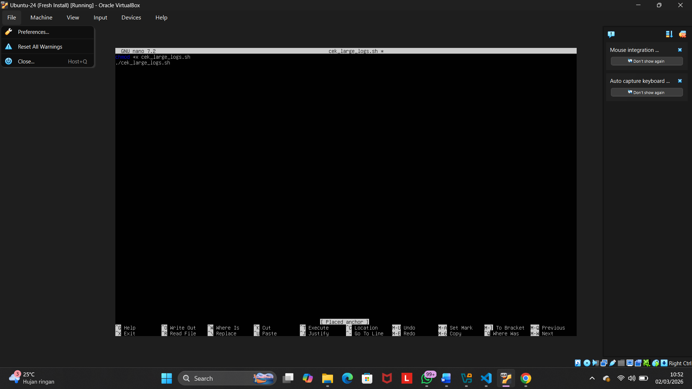
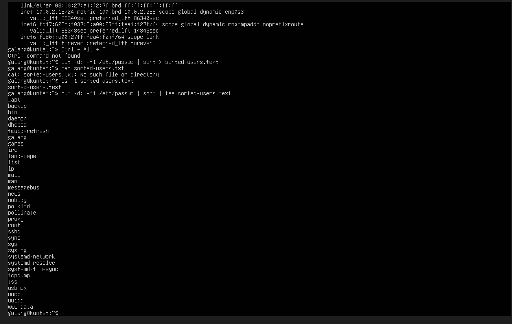
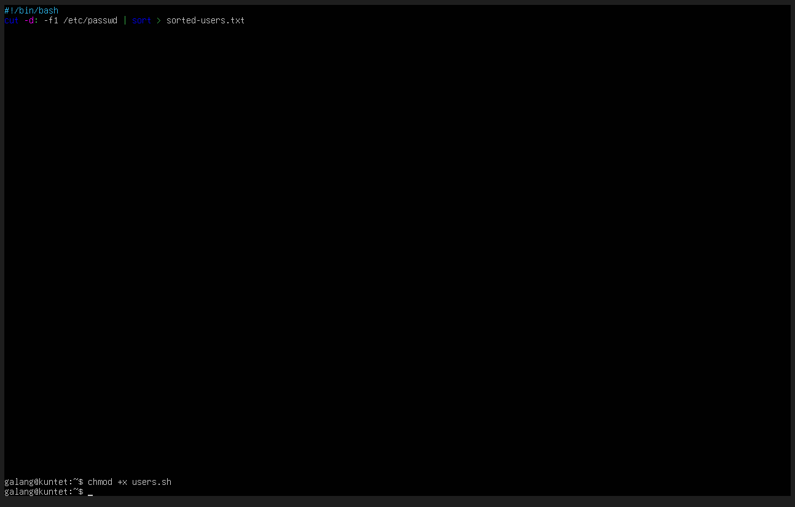
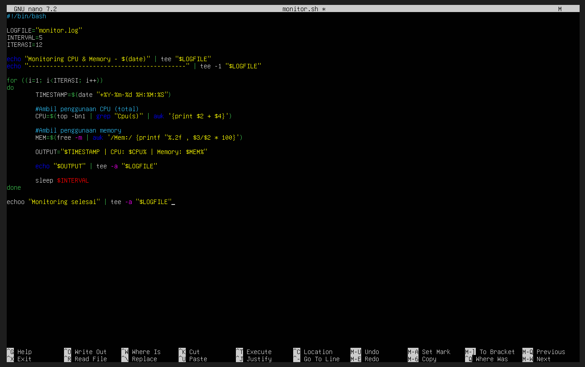
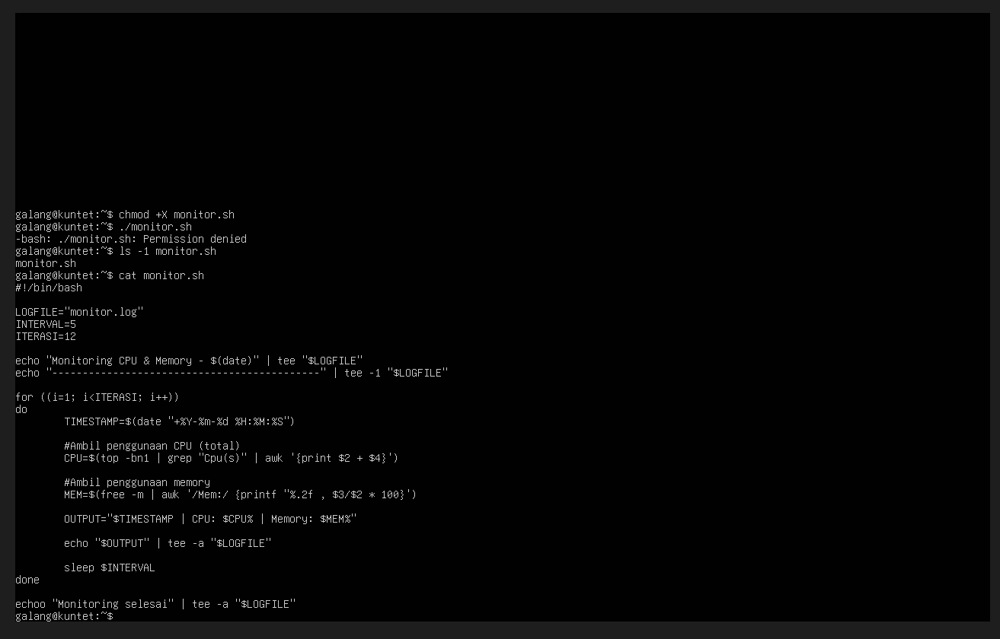
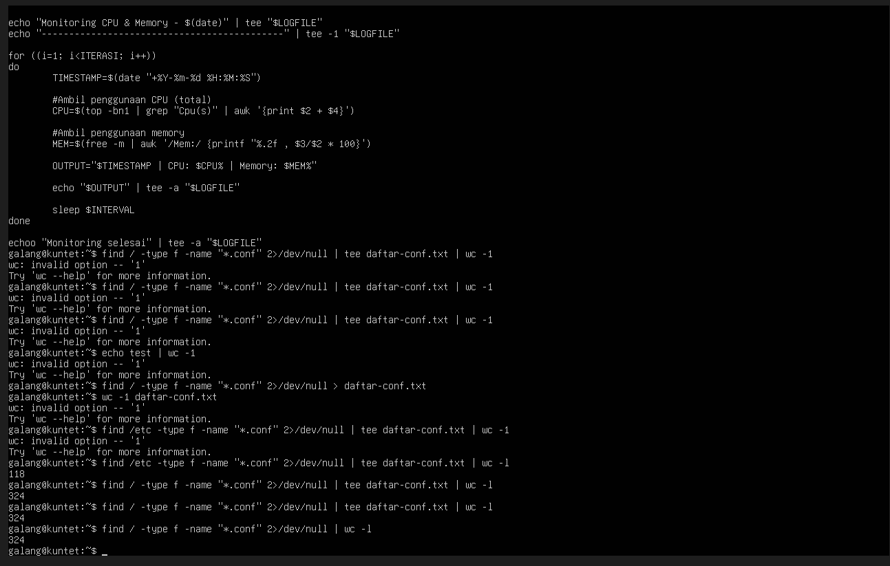
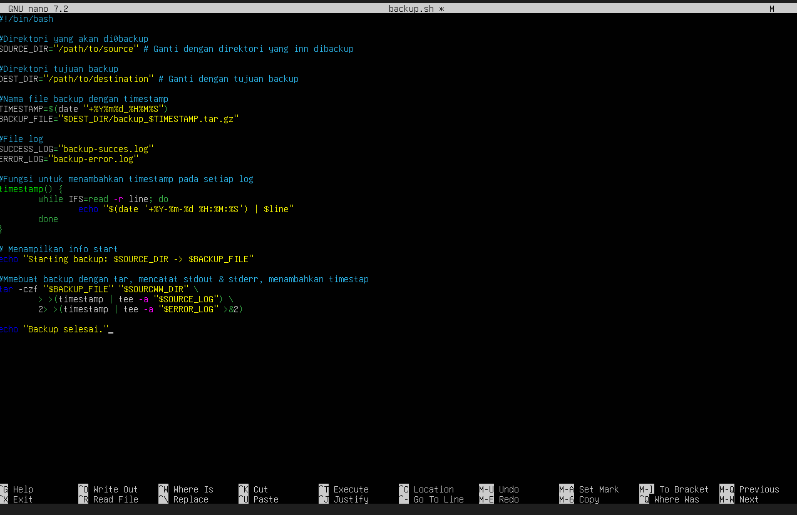
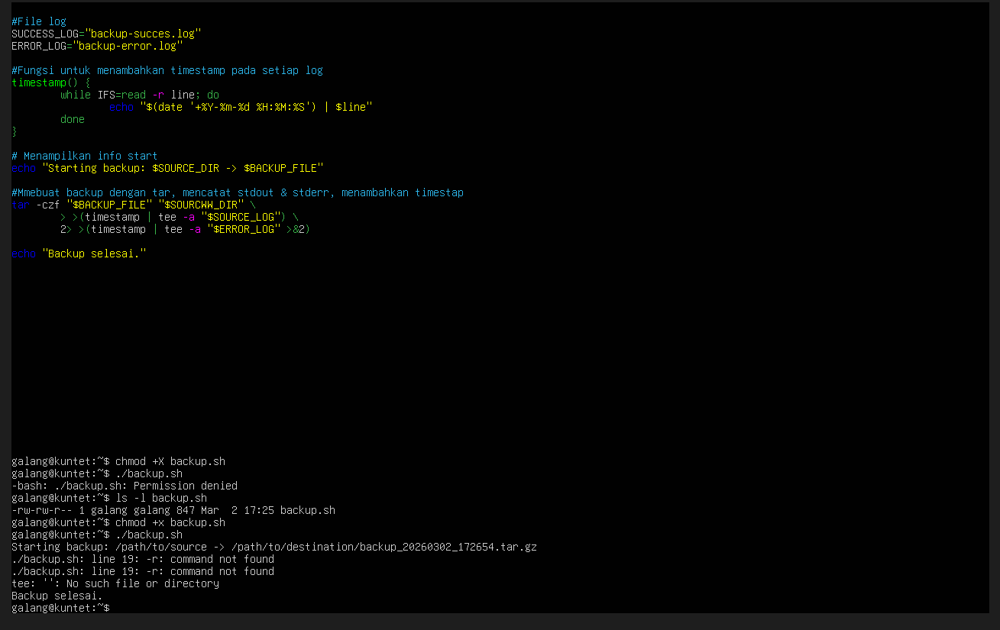

# PERTEMUAN 3

<h4> Nama : Galang Satriyo Anorrogo Winnada<h4>
<h4> NIM : 254107020231<h4>
<h4> Kelas : TI 1-H<h4>

 ### Latihan 3.1
 
 
 ## Penjelasan
find "$TARGET" -type f → mencari semua file di /var/log

du -h → menampilkan ukuran file (human readable)

2>>"$ERROR" → redirect error (misalnya permission denied) ke error.log

sort -rh → urutkan dari terbesar

head -n 10 → ambil 10 file terbesar

tee "$OUTPUT" → tampil di terminal dan simpan ke large-logs.txt

### Latihan 3.2

## Penjelasan
cut -d: -f1 /etc/passwd
-d: menentukan delimiter :
-f1 mengambil kolom pertama (username)

sort
Mengurutkan secara alfabetis (default ascending)

sorted-users.txt
Menyimpan hasil ke file sorted-users.txt

### Latihan 3.3

## Penjelasan
INTERVAL=5 → jalan setiap 5 detik

ITERASI=12 → 12 × 5 detik = 60 detik (1 menit)

date → menambahkan timestamp

top -bn1 → ambil data CPU non-interaktif

free -m → ambil penggunaan memory

tee -a → tampil di terminal + simpan ke fil

### Latihan 3.4

## Penjelasan
find / -type f -name "*.conf"
Mencari semua file dengan ekstensi .conf mulai dari root /

2>/dev/null
Membuang pesan error seperti Permission denied

tee daftar-conf.txt
Menyimpan daftar path lengkap ke file daftar-conf.txt
Sekaligus menampilkan di terminal

wc -l
Menghitung jumlah file yang ditemukan

### Latihan3.5

## Penjelasan
tar -czf "$BACKUP_FILE" "$SOURCE_DIR"
Membuat archive .tar.gz dari direktori sumber

.> >(timestamp | tee -a "$SUCCESS_LOG")
Menangkap stdout, menambahkan timestamp, menulis ke log dan tampil di terminal

2> >(timestamp | tee -a "$ERROR_LOG" >&2)
Menangkap stderr, menambahkan timestamp, menulis ke log dan tampil di terminal

timestamp()
Fungsi untuk menambahkan timestamp di depan setiap baris log

$TIMESTAMP
Digunakan untuk nama file backup agar unik setiap kali dijalankan