 # PERTEMUAN 3

<h4> Nama : Galang Satriyo Anorrogo Winnada<h4>
<h4> NIM : 254107020231<h4>
<h4> Kelas : TI 1-H<h4>

### Tugas Pendahuluan
alah pertanyaan  di bawah ini:
1. Apa yang di maksud perintah-perintah direktory: pwd, cd, mkdir, rmdir
2. Apa yang dimaksud perintah-perintah manipulasi file: cp, mv dan rm (sertakan format yang digunakan)
3. jelaskan perbedaan symbolic link menggunakan hard link (direct) dan soft link (indirect)
4. Tuliskan maksud perintah-perintah : file, find, which, locate dan grep
### Jawaban
1.  pwd : Digunakan untuk menampilkan direktori aktif saat ini
    cd : Digunakan untuk berpindah direktori
    mkdir : Digunakan untuk membuat direktori baru
    rmdir : Digunakan untuk menghapus direktori kosong
2.  cp : Digunakan untuk menyalin file atau folder 
    mv : Digunakan untuk memindahkan atau mengganti nama file
    rm : Digunakan untuk menghapus file atau direktori
3. Hard link (direct) : Mengarah Langsung ke indo file 
                        Tidak bisa lintas partisi
                        jika file asli dihapus, file masih bisa diakses
                        ukuran file sama 
    soft link (symbolic/indirect) : Mengarah ke nama/path file
                                    Bisa lintas partisi
                                    Jika file asli dihapus, link rusak
                                    Ukuran kecil (hanya menyimpan path)
4.  file : Digunakan untuk mengetahui tipe file
    Find : Digunakan untuk mencaari file dalam direktori tertentu
    which : Digunakan untuk mengetahui lokasi executable suatu perintah
    locate : Digunakan untuk mencari file dengan database index (lebih cepat dari find)
    grep : Digunakan untuk mencari teks dalam file 
### Percobaan 1 Direktory
> 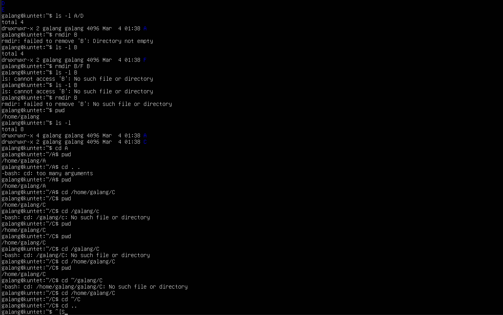
### Percobaan 2 Manipulasi fie
1. Perintah cp untuk mengkopi file atau seluruh direktori
> 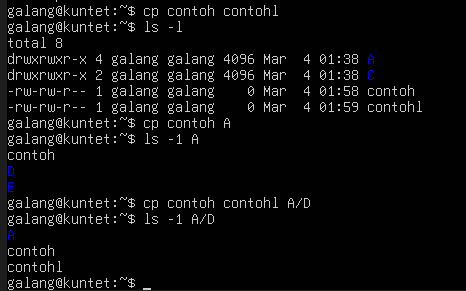
2. Perintah mv untuk memindah file 
> 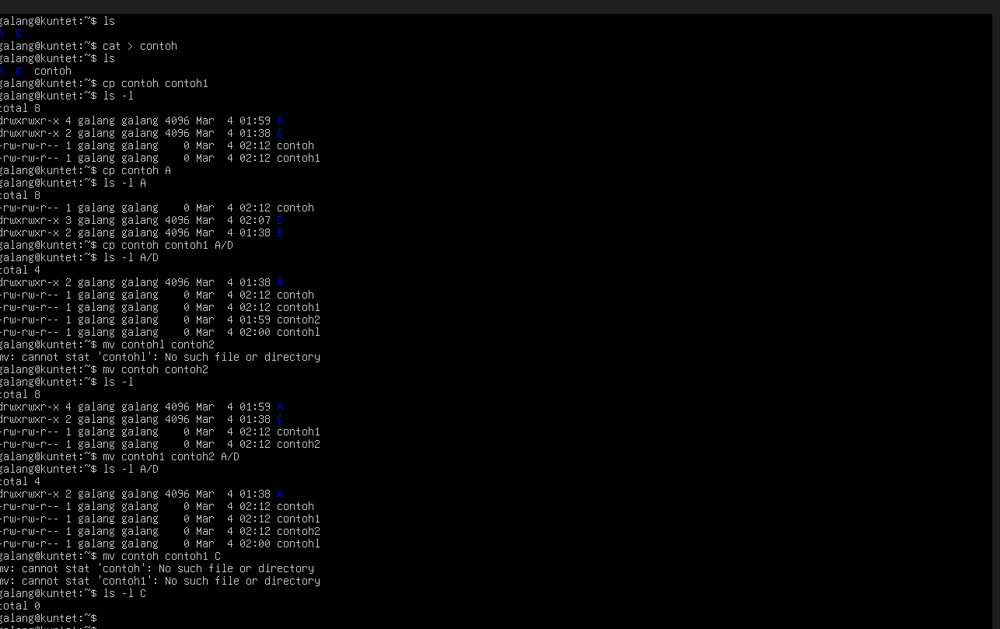
3. Perintah rm untuk menghapus file
> 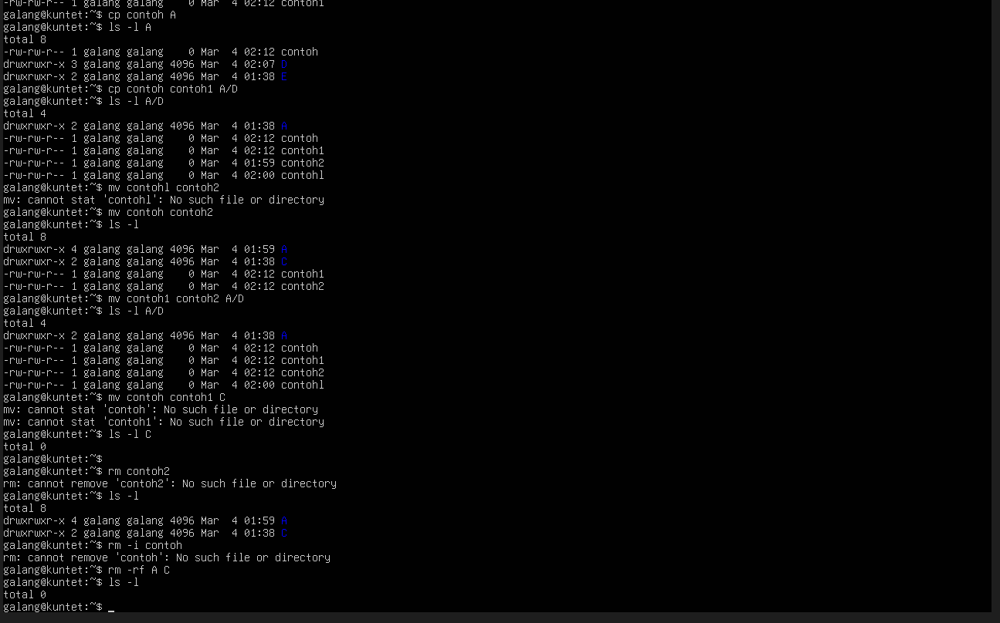
### Percobaan 3 Symbolic Link
1. Membuat shortcut (file link)
> 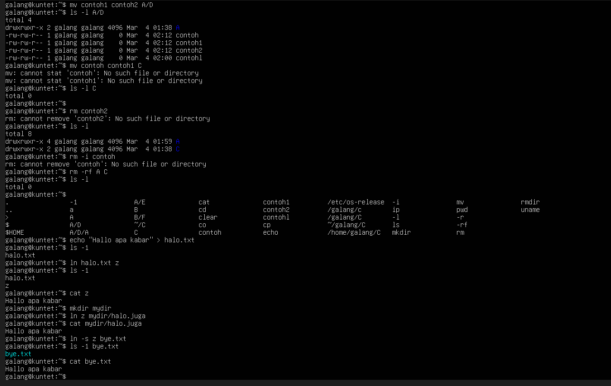
### Percobaan 4 Melihat isi file
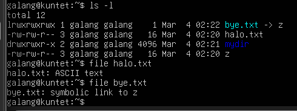
### Percobaan 5 mencari file
1. perintah find
> 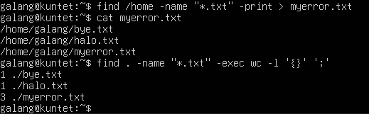
2. perintah which
> 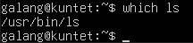
3. Perintah locate
> 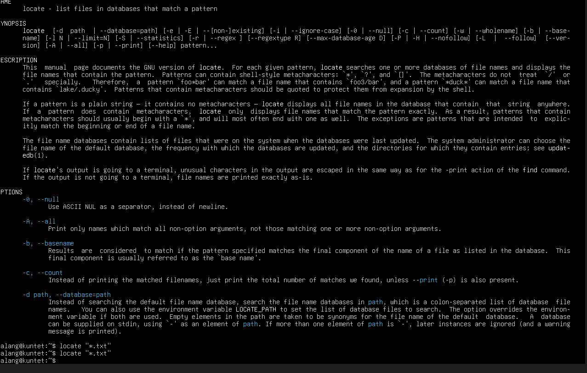
### Percobaan 6 Mencari text pada file
>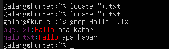
### Latihan 
1. Cobalah urutan perintah berikut: 
> 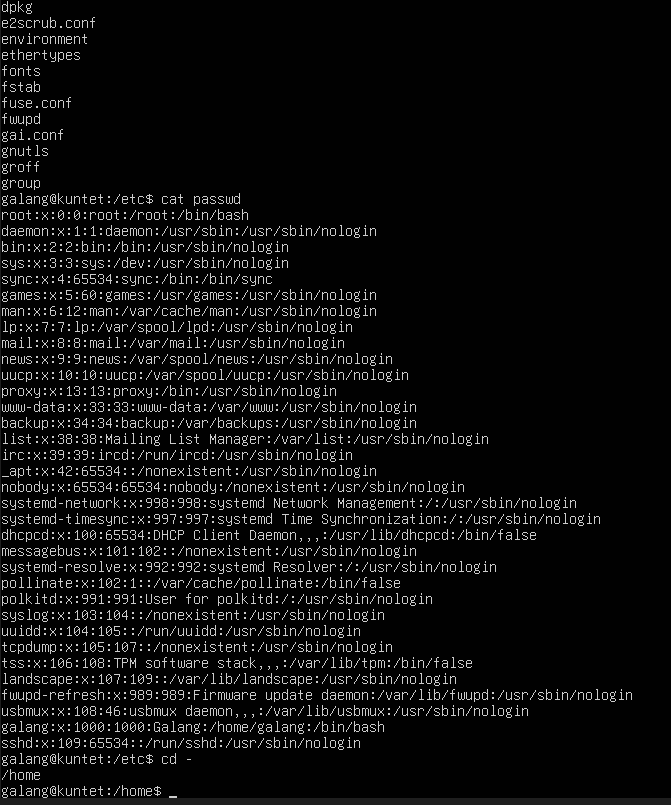
2. Lanjutkan penelusuran pohon pada sistem file menggunakan cd, ls , pwd dan cat. Telusuri direktory
/bin, /usr/bin, /sbin, /tmp dan /boot
> 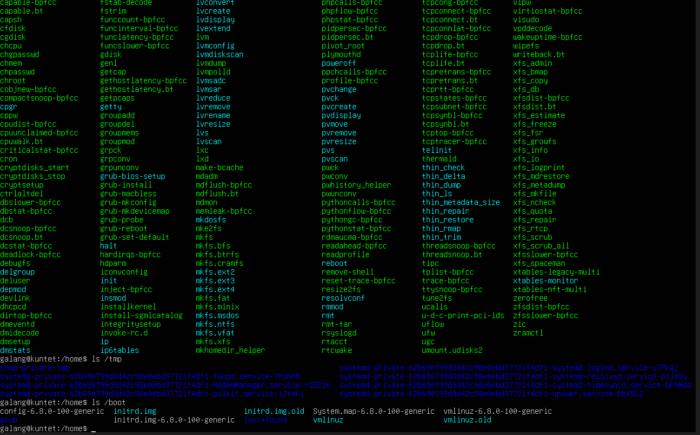
3. Telusuri direktory /dev. identifikasi perangkat yang tersedia. Identifikasi tty (terminal) anda (ketik who am i); siapa 
pemilih tty anda (gunakan ls -l).
> 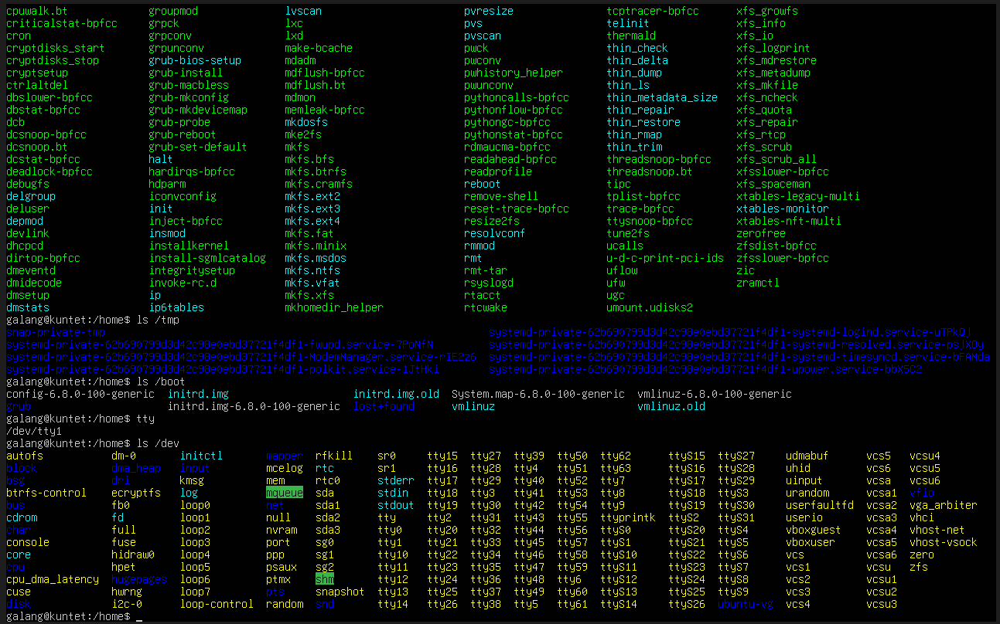
4. Telusuri derectory /proc. Tampilkan isi file interrupts, devices, cpuinfo, meminfo dan uptime menggunakan perintah cat. 
Dapatkah Anda melihat mengapa directory /proc disebut pseudo-filesystem yang memungkinkan akses ke struktur data kernel?
> 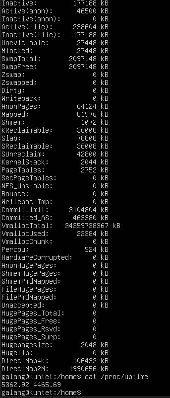
5. Ubahlah direktory home ke user lain secara langsung menggunakan cd -username
> 
6. Ubah kembali ke directory home anda
> 
7. Buat subdirectory work dan play
> 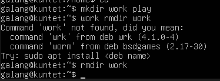
8. Hapus subdirectory work
> 
9. copy file /etc/passwd ke directory home anda
> 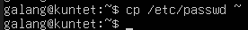
10. Pindahkan ke subdirectory play
> 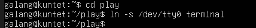
11. Ubahlah ke subdirectory play dan buat symbolic link dengan nama terminal yang menunjuk ke perangkat tty.
Apa yang terjadi jika melakukan hard link ke perangkat tty?
> 
12. Buatlah file bernama hello.txt yang berisi kata "hello word". Dapatkah Anda gunakan "cp" menggunakan "terminal" sebagai file asal untuk menghasilkan efek yang sama
> 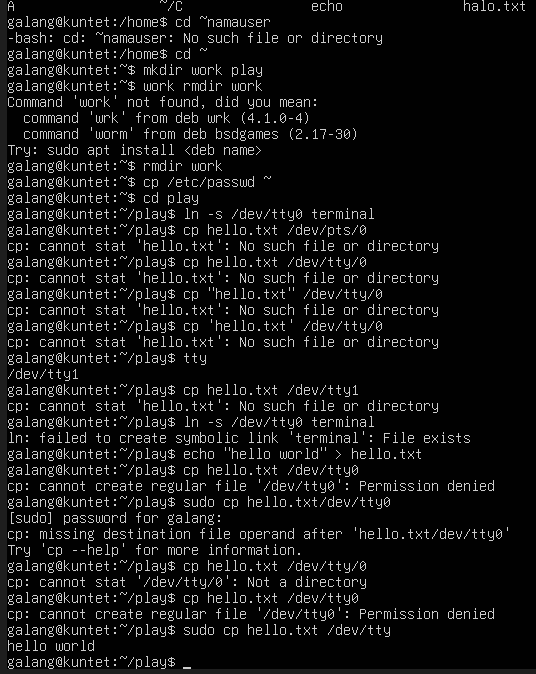
13. Copy hello.txt ke terminal. Apa yang terjadi?
> 
14. Masih direktory home, copy keseluruhan direktory play ke directory bernama work menggunakan symbolic link
> 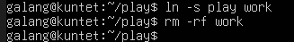
15. Hapus direktory work dan isinya dengan satu perintah
> 
### Laporan Resmi
1. Analisa hasil percobaan yang anda lakukan 
    a analisa setiap hasil tampilnya 
    b pada percobaan 1 point 3 buatlah pohon dari struktur file dan direktori
    c bila terdapat pesan error, jelaskan penyebabnya
2. Kerjakan latihan diatas dan analisa hasil tampilnya
3. Berikan kesimpulan dari praktikum ini
### Jawaban
1.  a.  
        
        
        
        
        
    b.  1. Pohon Struktur File dan Direktori (Point 3)
        Pada poin 3, Anda menjalankan perintah $ mkdir A B C A/D A/E B/F A/D/A. Perintah ini membuat struktur direktori bercabang (sub-direktori) dalam satu baris perintah. Berikut adalah visualisasi struktur pohonnya:
    c. Analisa Pesan Error (Point 4)
        Pada poin 4, terdapat dua kondisi yang menghasilkan pesan error saat mencoba menghapus direktori. Berikut penjelasannya:
        Error pada $ rmdir B:
        Penyebab: Perintah rmdir hanya bisa digunakan untuk menghapus direktori yang benar-benar kosong. Berdasarkan struktur di atas, direktori B masih memiliki isi yaitu direktori F (B/F).
        Pesan Error Umum: rmdir: failed to remove 'B': Directory not empty.
        Error pada $ ls -l B (Setelah perintah rmdir B/F B):
        Penyebab: Perintah $ rmdir B/F B berhasil menghapus B/F terlebih dahulu, lalu menghapus direktori B yang sudah kosong. Karena direktori B sudah terhapus dari sistem, perintah ls -l B akan gagal karena target yang ingin dilihat sudah tidak ada.
        Pesan Error Umum: ls: cannot access 'B': No such file or directory.
2.  Perintah,Analisa Hasil Tampilan
    1-2,$ cd lalu $ pwd,Menampilkan direktori home user (misal: /home/user).
    3,$ ls -al,"Menampilkan seluruh file di home, termasuk file konfigurasi tersembunyi (dot files)."
    4-5,$ cd . lalu $ pwd,Tampilan tidak berubah karena . merujuk pada direktori saat ini.
    6-7,$ cd .. lalu $ pwd,Posisi naik ke /home. Anda akan melihat daftar direktori milik user lain jika ada.
    9-11,$ cd .. lalu $ pwd,"Posisi naik ke Root (/). Perintah ls -al akan menampilkan direktori sistem utama seperti bin, etc, root, dan usr."
    12-13,$ cd /etc lalu ls -al | more,Masuk ke pusat konfigurasi sistem. Output ditampilkan per halaman agar mudah dibaca.
    14,$ cat passwd,Menampilkan teks panjang berisi daftar akun user dan shell yang digunakan di sistem tersebut.
    15-16,$ cd - lalu $ pwd,"Shortcut untuk kembali ke direktori sebelumnya (dalam urutan ini, akan kembali ke Root (/))."
3. >1. Kesimpulan Praktikum Algoritma (Java)
    Praktikum ini berhasil memberikan pemahaman mendalam mengenai manajemen data kelompok menggunakan konsep Array of Objects.
    Efisiensi Struktur Data: Penggunaan array of objects memungkinkan penyimpanan data yang kompleks (seperti kode, nama, dan usia) dalam satu variabel terstruktur, bukan variabel terpisah-pisah.
    Peran Constructor: Constructor sangat krusial untuk memastikan setiap objek dalam array diinisialisasi dengan data yang lengkap saat dibuat (instansiasi).
    Optimalisasi Looping: Perulangan for sangat efektif untuk proses input yang membutuhkan indeks, sedangkan perulangan for-each memberikan sintaks yang lebih bersih dan aman saat menampilkan data ke layar.
    Manajemen Buffer: Penanganan input menggunakan Scanner memerlukan ketelitian, terutama penggunaan nextLine() setelah nextInt() untuk mencegah terjadinya skipping pada input teks berikutnya.
>   2. Kesimpulan Praktikum Sistem Operasi (Linux)
    Percobaan ini memperkuat pemahaman mengenai cara kerja sistem file pada lingkungan berbasis UNIX/Linux melalui baris perintah (CLI).
    Hierarki Filesystem: Struktur direktori Linux bersifat hirarkis yang dimulai dari Root (/), di mana setiap direktori memiliki fungsi spesifik (seperti /etc untuk konfigurasi dan /dev untuk perangkat keras).
    Navigasi dan Operasi File: Perintah dasar seperti cd, pwd, dan ls adalah fondasi untuk mengelola sistem. Memahami simbol seperti . (direktori saat ini) dan .. (direktori parent) mempermudah mobilitas antar folder.
    Linkage (Tautan): Fitur Symbolic Link (ln -s) terbukti sangat berguna untuk membuat pintasan (shortcut) antar direktori tanpa harus menduplikasi data aslinya, sehingga menghemat ruang penyimpanan.
    Keamanan dan Aturan Direktori: Sistem operasi menerapkan aturan ketat, seperti perintah rmdir yang hanya mengizinkan penghapusan direktori yang benar-benar kosong untuk mencegah kehilangan data secara tidak sengaja.
    Kesimpulan Akhir:
    Kedua praktikum ini saling melengkapi; satu mengasah kemampuan logika pemrograman dalam mengelola data di memori, sementara yang lain mengasah kemampuan administrasi sistem dalam mengelola data di media penyimpanan fisik.